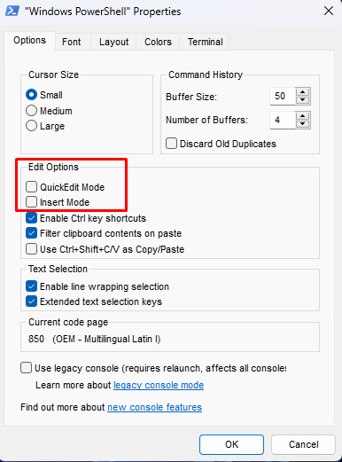

# Uso del script de configuración de Windows

Este script de configuración de Windows se encarga de instalar y configurar las herramientas necesarias para mi entorno Windows.

## Requisitos

- Windows 10 o superior
- Windows PowerShell
- Configurar Windows PowerShell



## Uso

Para ejecutar el script, simplemente ejecuta el siguiente comando en PowerShell:

```powershell
Set-ExecutionPolicy -ExecutionPolicy RemoteSigned -Scope LocalMachine -Force
irm https://raw.githubusercontent.com/Xabierland/dotfiles/main/scripts/windows/setup.ps1 | iex

```

o

```powershell
Set-ExecutionPolicy -ExecutionPolicy RemoteSigned -Scope LocalMachine -Force
./setup.ps1

```

Para mantener todo al dia ejecuta los siguientes comandos:

```powershell
winget upgrade
choco upgrade all

```

Si quieres instalar un programa nuevo, en vez de ir a la web usa el siguiente comando:

```powershell
choco install <nombre_del_programa>

```

o

```powershell
winget install <nombre_del_programa>

```

## Acciones

1. Permisos y herramientas necesarias
2. ~~Debloat Windows~~
3. Instalación de programas

## Lista de programas

> [!Caution]
> Puede haber programas que no se instalen debido a que la versión de Chocolatey o WinGet no este bien configurado. Ejecuta el script pasados unos dias o instalalos manualmente. Los paquetes marcados con un asterisco (*) son los que mas problemas suelen dar.

- Gestores de paquetes
  - WinGet [INSTALADO]
  - Chocolatey [INSTALADO]
- Administración
  - Windows Terminal [INSTALADO]
  - PowerShell [INSTALADO]
  - PowerToys [NO INSTALADO]
  - AutoHotkey [INSTALADO]
  - Autoruns [INSTALADO]
  - Process Explorer [INSTALADO]
  - Process Monitor [INSTALADO]
  - Process Hacker [INSTALADO]
  - sysinternals [INSTALADO]
- Información del sistema
  - CPU-Z [INSTALADO]
  - GPU-Z [NO INSTALADO]
  - HWMonitor [INSTALADO]
  - Victoria [INSTALADO]
  - CrystalDiskInfo [INSTALADO]
  - CrystalDiskMark [INSTALADO]
- Utilidades
  - Rufus [NO INSTALADO]
  - 7-Zip [INSTALADO]
  - wget [INSTALADO]
  - sed [INSTALADO]
  - netcat [INSTALADO]
  - awk [INSTALADO]
  - cURL [INSTALADO]
  - vim [INSTALADO]
  - nano [INSTALADO]
  - gpg4win [INSTALADO]
  - tree [INSTALADO]
  - less [INSTALADO]
  - make [INSTALADO]
  - exiftool [INSTALADO]
  - grep [INSTALADO]
- Navegadores
  - Mozilla Firefox [INSTALADO]
  - LibreWolf [INSTALADO]
  - Tor Browser [INSTALADO - NO START MENU]
- Ofimática
  - LibreOffice [INSTALADO]
  - MiKTeX*
  - Adobe Acrobat Reader DC [INSTALADO]
  - Obsidian [INSTALADO]
- Audio, fotos y vídeo
  - VLC [INSTALADO]
  - Stremio [INSTALADO]
  - Audacity [INSTALADO]
  - OBS Studio [INSTALADO]
  - FFmpeg [INSTALADO]
  - HandBrake [INSTALADO]
  - Spotify [INSTALADO]
  - Reaper [INSTALADO]
  - Voicemeeter Banana [NO SE INSTALA DEL TODO]
  - VB-CABLE [NO INSTALADO]
  - GIMP [INSTALADO]
  - Paint.NET [INSTALADO]
  - Inkscape [INSTALADO]
- Contraseña
  - Bitwarden [INSTALADO]
  - KeePassXC [INSTALADO]
- IDEs/Runtimes/Compiladores
  - Visual Studio Code [NO INSTALADO]
  - IntelliJ IDEA [INSTALADO]
  - Git [INSTALADO]
  - GitHub Desktop [INSTALADO]
  - Anaconda3 (Python)*
  - Node.js (JavaScript) [INSTALADO]
  - Ruby [INSTALADO]
  - Golang (Go) [INSTALADO]
  - Rust [INSTALADO]
  - OpenJDK (Java) [INSTALADO]
  - CMake (C/C++) [NO INSTALADO]
  - LLVM (C/C++) [INSTALADO]
  - PHP [INSTALADO]
  - Strawberry Perl (Perl) [INSTALADO]
  - docker-desktop*
  - aws-cli [INSTALADO]
  - azure-cli
  - gcloud-sdk [INSTALADO]
  - minikube [INSTALADO]
  - kubernetes-cli [INSTALADO]
  - kubernetes-helm [INSTALADO]
  - terraform [INSTALADO]
- Otros
  - Everything [NO INSTALADO]
  - Transmission [INSTALADO]
  - Discord [INSTALADO]
  - Telegram [INSTALADO]
  - VirtualBox [INSTALADO]
  - Oh My Posh [INSTALADO]
